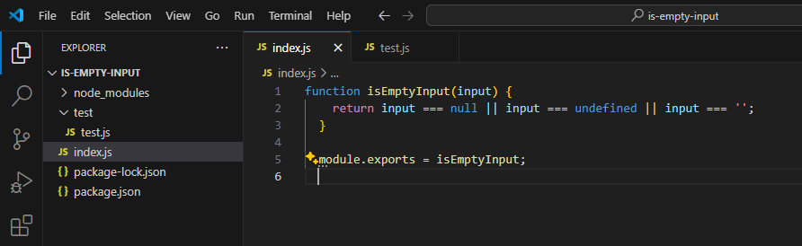

# Creating Simple NPM Package


## Introduction
In this guide, we will create a simple NPM package that checks if a given input is "null, undefined, or an empty string". This package can be useful for various validation tasks in JavaScript projects. We will cover everything from setting up a new package to publishing it on NPM.

## Prerequisites

Before we start, make sure you have the following:

- Node.js installed on your system
- Basic knowledge of JavaScript and NPM
- An NPM account for publishing the package (if you don't have one, you can sign up at npmjs.com/signup)

## Step 1: Setting Up the Project Structure

First, let's create a new directory for our project:
```bash
mkdir is-empty-input
cd is-empty-input
```

Next, initialize the package with 'npm init':
```bash
npm init
```

Follow the prompts to enter the package name, version, description, entry point, test command, etc. For this guide, let's keep the defaults except for:

- name: 'is-empty-input'
- description: "A simple package to check if input is null, undefined, or an empty string"
- entry point: 'index.js'

## Step 2: Creating the Package Code
In the root directory, create the main file 'index.js':
```bash
touch index.js
```

Open 'index.js' and add the following code:
```jsx
function isEmptyInput(input) {
  return input === null || input === undefined || input === '';
}

module.exports = isEmptyInput;
```
This simple function checks whether the provided input is "null, undefined, or an empty string" and returns "true" or "false" accordingly.


## Step 3: Adding Tests
It's a good practice to include tests with your package. Create a 'test' folder and add a test file:
```bash
mkdir test
touch test/test.js
```
Add some test cases to 'test/test.js':
```jsx
const assert = require('assert');
const isEmptyInput = require('../index');

describe('isEmptyInput', () => {
  it('should return true for null', () => {
    assert.strictEqual(isEmptyInput(null), true);
  });

  it('should return true for undefined', () => {
    assert.strictEqual(isEmptyInput(undefined), true);
  });

  it('should return true for empty string', () => {
    assert.strictEqual(isEmptyInput(''), true);
  });

  it('should return false for non-empty string', () => {
    assert.strictEqual(isEmptyInput('hello'), false);
  });

  it('should return false for numbers', () => {
    assert.strictEqual(isEmptyInput(0), false);
  });
});
```

Your folder structure should look like this:-



To run the tests, install a testing framework like "mocha":
```bash
npm install --save-dev mocha
```
Now run the tests:
```bash
npx mocha
```


All tests should pass if everything is set up correctly.


## Step 4: Preparing for Publishing
To publish your package to NPM, you need to log in. Use the following command to log in with your NPM account:
```bash
npm login
```

Follow the prompts to enter your username, password, and email.

Next, ensure your package.json file has a repository field (if you intend to host the source code somewhere like GitHub) and keywords to help people find your package:

```jsx
{
  "name": "is-empty-input",
  "version": "1.0.0",
  "description": "A simple package to check if input is null, undefined, or an empty string",
  "main": "index.js",
  "scripts": {
    "test": "mocha"
  },
  "keywords": ["validation", "empty", "null", "undefined"],
  "author": "Your Name",
  "license": "MIT",
  "repository": {
    "type": "git",
    "url": "https://github.com/yourusername/is-empty-input.git"
  }
}
```


## Step 5: Publishing to NPM
With everything set, publish your package to NPM:
```bash
npm publish
```


If successful, you'll see a message confirming that your package has been published. You can now find your package on NPM and use it in other projects.


## Conclusion 🎉
In this guide, we've created a simple NPM package that checks if a given input is "null, undefined, or an empty string". We initialized a new project, wrote code to implement the package's functionality, added tests, and published it on NPM. This package can serve as a basic utility for various validation tasks. Now that you've created your first package, consider adding more features, writing more comprehensive tests, or improving documentation to enhance its usability and maintainability.